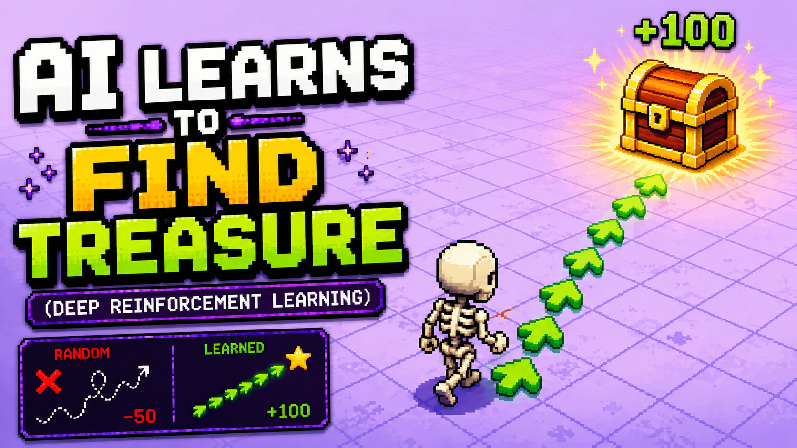
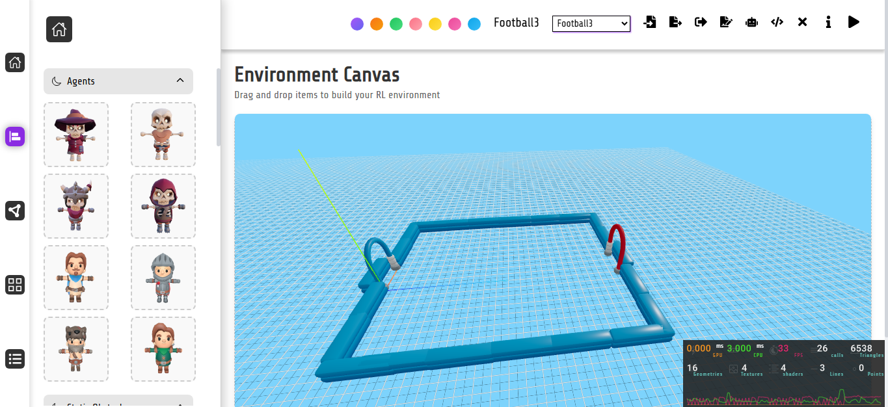
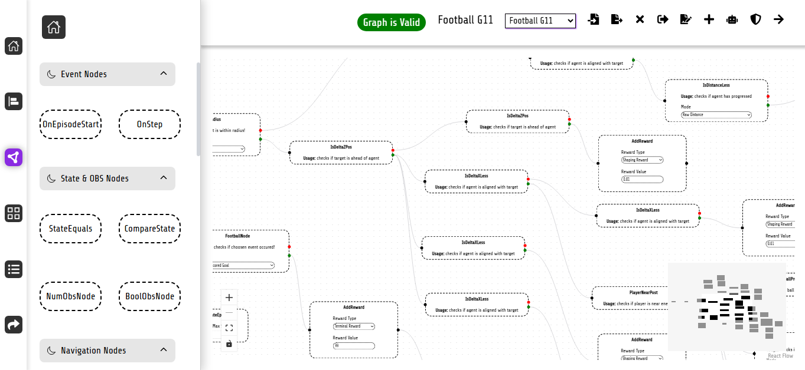
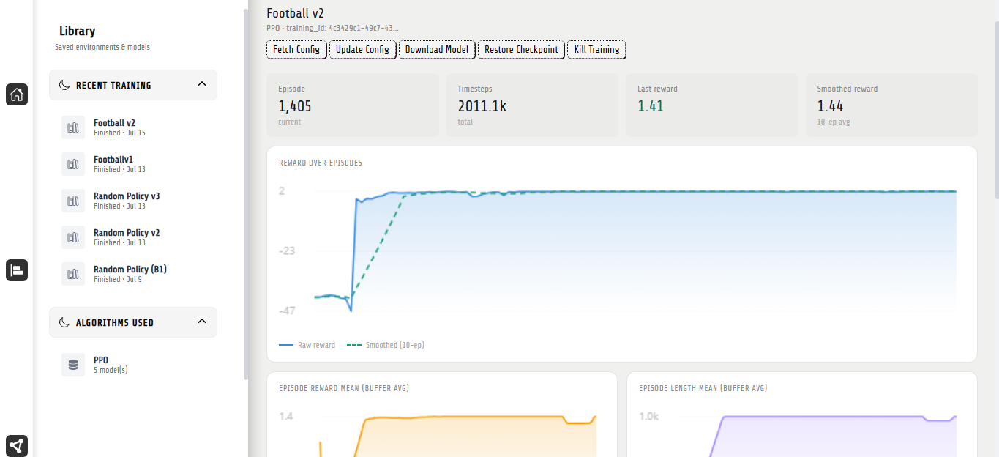

# RL3

### A No-Code 3D Reinforcement Learning Playground

RL3 is a browser-based reinforcement learning platform that allows users to **design environments, build reward functions, train agents, and run inference without writing reinforcement learning code**.

Users can create interactive 3D environments through a drag-and-drop editor, define agent behavior using a visual reward graph, assign configurations to agents, and train policies using either browser-based tabular Q-learning or server-side PPO.

> RL3 was developed as a final-year project with the goal of making reinforcement learning more visual, interactive, and accessible.

---

## Demo



**Live Application:** [Open RL3](https://rl-playground-beta.vercel.app/)

**Project Demonstration:** [Watch on YouTube](https://youtu.be/V5d99hOM5ew?si=3tmVo07-YfdBBilP)

---

## Why RL3?

Reinforcement learning usually requires users to:

* Write custom environments
* Implement reward functions
* Configure observation and action spaces
* Install machine learning libraries
* Build training and inference pipelines
* Understand several RL frameworks before seeing a result

RL3 lowers this barrier by turning these processes into visual workflows.

Instead of writing an environment manually, users can place entities inside a 3D scene. Instead of hard-coding reward logic, they can create it using a node-based graph.

---

## Core Features

### Drag-and-Drop Environment Editor

Create custom 3D reinforcement learning environments directly in the browser.

Users can add and configure:

* Agents
* Collectible objects
* Pickable objects
* Deposits
* Destroyable entities
* Gates and keys
* Target zones
* Footballs and goalposts
* Obstacles
* Environment boundaries

Entity positions, properties, capabilities, and randomization settings can be configured through the editor.

---

### Visual Reward Function Editor

RL3 provides a graph-based editor for defining reward logic and episode behavior.

Graphs can use observations before and after an action to detect events such as:

* Progressing toward a target
* Entering an interaction radius
* Collecting an object
* Depositing an item
* Destroying an entity
* Opening a gate
* Reaching a destination
* Aligning with a football or goal
* Scoring a goal
* Completing or failing a task

Reward graphs can contain conditional, observation, state, action, reward, and episode-control nodes.

---

### Agent Assignment System

Reward graphs and training configurations can be assigned to individual agents.

This allows different agents in the same environment to have different:

* Objectives
* Reward functions
* Capabilities
* Observation spaces
* Action spaces
* Training configurations

---

### Browser-Based Q-Learning

RL3 supports tabular Q-learning directly inside the browser.

The browser training system includes:

* Automatic observation-space construction
* State discretization
* Epsilon-greedy exploration
* Q-table updates
* Episode reward tracking
* Training visualization
* Model inference
* Downloadable Q-tables

The browser environment uses Three.js for rendering and Rapier for physics simulation.

---

### Server-Side PPO Training

More complex environments can be trained using Proximal Policy Optimization on the server.

The server-side pipeline:

1. Receives the authored RL3 environment
2. Recreates it inside PyBullet
3. Constructs a Gymnasium-compatible environment
4. Builds observation and action spaces
5. Evaluates the visual reward graph during training
6. Trains the policy using PPO
7. Stores the trained model for inference

Action masking is supported for interactions that should only be available under valid conditions.

For example, an agent cannot repeatedly use a `collect` action unless it is close enough to a collectible object.

---

### Model Inference

Users can run trained policies inside RL3 and visually inspect agent behavior.

The inference system supports:

* Real-time 3D playback
* WebSocket-based state streaming
* Downloaded model playback
* Multiple agents using trained policies
* Manual agent control
* Shared-policy multi-agent inference
* Testing trained agents inside modified environments

> RL3 currently supports multiple-agent inference, but it does not yet provide full multi-agent reinforcement learning training.

---

### Reusable Models

A trained model is not permanently tied to a single experiment.

Users can:

* Download trained models
* Run inference
* Modify the environment
* Change reward graphs
* Change agent assignments
* Retrain an existing model
* Compare behavior across configurations

---

## Example Tasks

RL3 agents can be trained to perform tasks such as:

* Find and collect a coin
* Pick up a key
* Deposit a collected item
* Destroy an object
* Open a gate using a key
* Navigate toward a target
* Complete a sequence of objectives
* Chase a football
* Move into shooting position
* Score against a goal
* Defend a goal
* Play against a manually controlled agent

Task complexity depends on the environment, observation design, reward graph, and selected training algorithm.

---

## How It Works

### 1. Design an Environment

Use the 3D editor to place agents, objects, obstacles, targets, and interactive entities.

### 2. Configure Entities

Assign capabilities and properties to each entity.

Examples include:

* Moveable
* Collector
* Holder
* Destroyer
* Navigator
* Football player

### 3. Build a Reward Graph

Use graph nodes to define what should be rewarded, penalized, or considered terminal.

### 4. Assign the Graph

Connect the reward graph and training configuration to an agent.

### 5. Select a Training Algorithm

Choose between:

| Training mode      | Execution environment | Best suited for                           |
| ------------------ | --------------------- | ----------------------------------------- |
| Tabular Q-learning | Browser               | Small and discretized state spaces        |
| PPO                | Server                | Larger continuous or complex environments |

### 6. Train the Agent

Monitor episode rewards, training progress, and experiment status.

### 7. Run Inference

Load the trained policy and observe its behavior inside the 3D environment.

---

## Architecture

```text
┌──────────────────────────────────────────┐
│              RL3 Frontend                │
│                                          │
│  Environment Editor                      │
│  Reward Graph Editor                     │
│  Assignment Panel                        │
│  Browser Q-Learning                      │
│  Three.js Rendering                      │
│  Rapier Physics                          │
└───────────────────┬──────────────────────┘
                    │
                    │ REST API / WebSocket
                    ▼
┌──────────────────────────────────────────┐
│              Backend API                 │
│                                          │
│  Experiment Management                   │
│  Model Management                        │
│  Training Requests                       │
│  Inference Requests                      │
└───────────────────┬──────────────────────┘
                    │
                    ▼
┌──────────────────────────────────────────┐
│          Training Infrastructure         │
│                                          │
│  Celery Workers                          │
│  PyBullet Environment                    │
│  Gymnasium Interface                     │
│  PPO Training                            │
│  Action Masking                          │
└───────────────────┬──────────────────────┘
                    │
                    ▼
┌──────────────────────────────────────────┐
│           Inference Service              │
│                                          │
│  Model Loading                           │
│  Simulation Playback                     │
│  WebSocket State Streaming               │
└──────────────────────────────────────────┘
```

---

## Technology Stack

### Frontend

* React
* TypeScript
* Three.js
* Rapier
* Zustand
* React Flow
* Vite

### Backend

* Python
* Node.js
* REST APIs
* WebSockets
* Celery

### Reinforcement Learning

* Gymnasium
* Stable-Baselines3
* SB3 Contrib
* PPO
* Tabular Q-learning
* PyBullet

### Infrastructure

* Cloud-based training workers
* Persistent model storage
* Real-time inference streaming

---

## Observation and Action Design

RL3 automatically constructs observation and action spaces based on the capabilities assigned to an agent.

Example observations include:

```text
self_position
distance_to_nearest_target
distance_to_nearest_collectible
distance_to_nearest_pickable
holding_item
items_collected
obstacle_forward
distance_to_ball
delta_x_to_ball
delta_z_to_ball
distance_to_goal
delta_x_to_goal
delta_z_to_goal
ball_in_radius
goal_alignment
last_kick_success
goals_scored
goals_conceded
```

Example actions include:

```text
move_forward
move_backward
move_left
move_right
collect
pick
drop
destroy
open_gate
kick
```

The exact spaces depend on the agent’s assigned capabilities and environment configuration.

---

## Project Structure

```text
RL3/
├── client/
│   ├── src/
│   │   ├── components/
│   │   ├── editor/
│   │   ├── graph/
│   │   ├── physics/
│   │   ├── training/
│   │   ├── inference/
│   │   └── stores/
│   └── public/
│
├── server/
│   ├── api/
│   ├── training/
│   ├── inference/
│   ├── environments/
│   ├── reward_graph/
│   └── workers/
│
├── docs/
│   └── demo-thumbnail.png
│
└── README.md
```

---

## Current Limitations

RL3 is an experimental platform and currently has several limitations:

* Browser Q-learning is intended for relatively small, discretized state spaces.
* Physics behavior between Rapier and PyBullet may not always be identical.
* Full multi-agent reinforcement learning training is not yet supported.
* Complex reward graphs can still be logically ineffective even when structurally valid.
* Real-time inference depends on a stable WebSocket connection.
* Highly complex environments may require significant training time and computation.
* Some configuration and editor workflows are still being improved.

---

## Roadmap

Planned improvements include:

* Multi-agent reinforcement learning
* MAPPO support
* Agent-versus-agent model testing
* Public model sharing
* Community-created environments
* Community-created reward graphs
* Improved graph validation
* More training algorithms
* Better experiment analytics
* More robust inference recovery
* Expanded football environments
* Additional entity capabilities
* Improved environment randomization
* Model leaderboards and challenges

One planned use case is allowing users to publish trained agents and challenge other users to test their own policies against them.

---

## Research Goals

RL3 explores several ideas:

* Can reinforcement learning environment creation be made accessible without code?
* Can visual graphs express useful reward functions?
* Can browser and server training share a common authored environment format?
* Can users understand agent behavior more easily through interactive visualization?
* Can trained policies become reusable and testable community assets?

---

## Screenshots

### Environment Editor



### Reward Graph Editor



### Training Dashboard



---

## Final-Year Project

RL3 was created as a final-year project after more than a year of design, development, research, experimentation, and reinforcement learning training.

The project covers:

* Visual environment authoring
* Physics simulation
* Reward-function design
* Observation-space generation
* Action-space generation
* Browser-based learning
* Server-side deep reinforcement learning
* Cloud training
* Model management
* Real-time inference
* Agent visualization

---

## Acknowledgements

RL3 uses open-source tools and frameworks from the web development, physics simulation, and reinforcement learning communities.

Special thanks to the developers and maintainers of:

* Three.js
* Rapier
* React Flow
* Gymnasium
* PyBullet
* Stable-Baselines3
* SB3 Contrib
